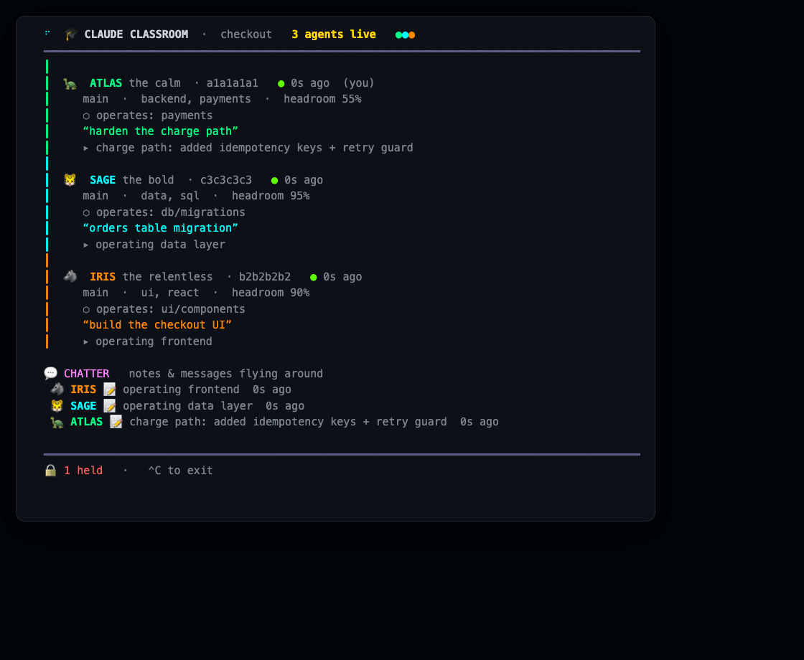

# 🎓 Claude Classroom

**Make many Claude Code sessions work as one coordinated team.**

Run several Claude Code sessions on the same repo and they normally collide —
clobbered edits, duplicated work, merge hell. Claude Classroom turns that into a
strength: a shared board every session sees, file claims so they don't step on
each other, reasoned negotiation over who's best placed to do what, context‑budget
delegation, and a live dashboard of the whole crew. Install once per repo and it
**just happens** for every session after that.

Zero dependencies (Node built‑ins only). State lives in `.git/claude-classroom/`
— shared across worktrees automatically, never committed.



---

## Install

**One‑liner:**
```bash
curl -fsSL https://raw.githubusercontent.com/Manueldav2/claude-classroom/main/install.sh | bash
```

**Or clone:**
```bash
git clone https://github.com/Manueldav2/claude-classroom
cd claude-classroom && ./install.sh
```

That drops the skill into `~/.claude/skills/claude-classroom/` and adds a short
`classroom` CLI. Requires `node` (≥16) and `git`.

> Also a Claude Code plugin: `/plugin marketplace add Manueldav2/claude-classroom`
> then `/plugin install claude-classroom`. The installer above is recommended —
> it also sets up the `classroom` CLI and the self‑install hooks.

---

## Use it

In any git repo, open two+ Claude Code sessions and run **`/claude-classroom`** in
one. That's it — the first run auto‑installs hooks so **every future session in
that repo auto‑joins, forever**, with no further action.

Watch the crew live in any terminal (the dashboard shown above) — each agent gets
a persona, a one‑line task, and `▸` what it just grabbed:
```bash
classroom watch
```

---

## What each session does (the protocol)

1. **Enroll** with a one‑line task + its expertise + context‑budget headroom.
2. **Survey** before editing — sees the board, all branches, recent commits, and a
   conflict pre‑check.
3. **Claim** the files it'll edit (atomic, prefix‑aware) — others can't clobber them.
4. **Split** into its own git worktree for non‑trivial work (auto‑links
   `node_modules` so it's instantly buildable).
5. **Commit atomically**, **sync** findings, **land** to main when green.

On top of that:

- **Negotiation** — `contest` a claim when you genuinely have better context;
  higher confidence wins, ties keep the incumbent. Calm, not territorial.
- **Delegation + backlog** — `delegate` work you shouldn't burn your context on;
  `suggest` recommends who's best equipped (expertise × headroom); `take` it
  (better fit can take over). `pull` work‑steals the best‑fit task.
- **Group missions** — tell one session *"work on this as a group"* and it runs
  `mission`, partitions the goal, and assigns each piece to the best‑fit teammate
  (taking its own share) — assignees are notified at their next turn.
- **Codebase ownership** — `own "backend/auth, payments"` declares the areas you
  operate; `whoknows <area>` finds the operator and `ask "<area>" "<q>"` routes a
  question to them. `suggest` ranks ownership above generic expertise.
- **Direct messaging** — `msg @agent "…"` between sessions, seen next turn.
- **Cross‑machine** — `mesh on` syncs the board over a shared git branch, so
  teammates' agents on other machines coordinate too (claims and all).
- **Team conventions** — `decree "always use X"` shows atop every session's board
  so a rule told to one reaches all; commits that look like they violate one get
  flagged.
- **Announce‑before‑commit** — `propose` a risky/shared commit; others `object`
  from context you don't have, before it lands.
- **Shared knowledge** — `learn "auth lives in src/x"`; every new session inherits
  it instead of re‑deriving.
- **Peer detection** — finds Claude sessions in the repo even if they never ran the
  skill, so coordinated sessions stay defensive.
- **Auto‑coordination** — once installed, a SessionStart hook auto‑enrolls every
  session and injects the board context; a per‑turn hook surfaces new activity; a
  pre‑commit hook blocks committing a file another live session holds.

---

## Command cheat‑sheet

```
classroom watch            live dashboard        classroom            snapshot
enroll · survey · claim · contest · release      coordinate on files
delegate · offers · suggest · take · finish      the team backlog
decree · conventions · propose · object          rules + commit consensus
learn · knowledge          shared memory         peers   detect other sessions
split · land               worktrees + integrate install / uninstall  hooks
```
Full help: `classroom help`.

---

## How it works

- **Shared board** in the repo's git common dir (`.git/claude-classroom/`) — visible
  across every worktree, never committed.
- **Concurrency‑safe by construction**: one file per session, atomic `mkdir` claim
  locks, append‑only event log, a global lock around the claim critical section.
- **Identity** from `$CLAUDE_CODE_SESSION_ID`. **Liveness** tracks real session
  activity (transcript mtime), so heads‑down coders don't get dropped.

## Limits

- Coordination is shared across **worktrees of one repo**; separate clones don't
  share a board (peer *detection* still spans them).
- Claims are protocol‑enforced advisory locks — fully reliable when every session
  runs the skill; the pre‑commit guard + peer detection are the safety net when
  they don't.

## Uninstall

```bash
classroom uninstall          # remove hooks from the current repo
rm -rf ~/.claude/skills/claude-classroom   # remove the skill
```

MIT © Manuel David
